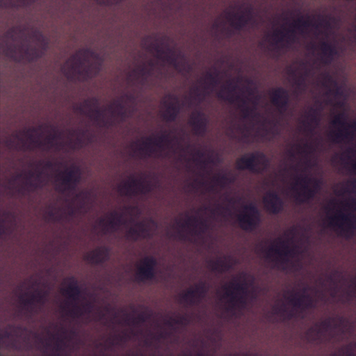

<h2>TensorFlow-FlexUNet-Image-Segmentation-Oesophagus-Nucleus (2025/08/22)</h2>

This is the first experiment of Image Segmentation for Oesophagus, 
 based on our 
 <a href="https://github.com/sarah-antillia/TensorFlow-FlexUNet-Image-Segmentation-Model">
<b>TensorFlowFlexUNet (TensorFlow Flexible UNet Image Segmentation Model for Multiclass)</b></a>
, and a 512x512 pixels 
<a href="https://drive.google.com/file/d/1MtmOTJUBfLplgT88wLFHvBXZf8n7dVph/view?usp=sharing">
<b>Augmented-Oesophagus-PNG-ImageMask-Dataset.zip</b></a>.
which was derived by us from 
  
<a href="https://www.kaggle.com/datasets/ipateam/nuinsseg">
NuInsSeg: A Fully Annotated Dataset for Nuclei Instance Segmentation in H&E-Stained Images.
</a>
 
 

On the derivation of the augmented dataset, please refer to our experiment 
<a href="https://github.com/sarah-antillia/Tensorflow-Image-Segmentation-Pre-Augmented-Oesophagus">
Tensorflow-Image-Segmentation-Pre-Augmented-Oesophagus
</a>.
 
 
As demonstrated in <a href="https://github.com/sarah-antillia/TensorFlow-FlexUNet-Image-Segmentation-STARE-Retinal-Vessel">
TensorFlow-FlexUNet-Image-Segmentation-STARE-Retinal-Vessel</a> ,
 our Multiclass TensorFlowFlexUNet, which uses categorized masks, can also be applied to 
single-class image segmentation models. 
This is because it inherently treats the background as one category and your single-class mask data as 
a second category. In essence, your single-class segmentation model will operate with two categorized classes within our Multiclass UNet framework.
 
 
<b>Acutual Image Segmentation for 512x512 pixels Oesophagus images</b> 

As shown below, the inferred masks predicted by our segmentation model trained on the 
PNG dataset appear similar to the ground truth masks.
 
<table>
<tr>
<th>Input: image</th>
<th>Mask (ground_truth)</th>
<th>Prediction: inferred_mask</th>
</tr>
<tr>
<td></td>
<td></td>
<td></td>
</tr>
<tr>
<td></td>
<td></td>
<td></td>
</tr>
<tr>
<td></td>
<td></td>
<td></td>
</tr>
</table>

 
<h3>1. Dataset Citation</h3>
The dataset used here has been take from the following kaggle web site 
<a href="https://www.kaggle.com/datasets/ipateam/nuinsseg/data">
NuInsSeg
</a>  

<b>About Dataset</b> 
NuInsSeg: A Fully Annotated Dataset for Nuclei Instance Segmentation in H&E-Stained Histological Images 
 
<b>Citation</b> 
@article{mahbod2023nuinsseg, 
  title={NuInsSeg: A Fully Annotated Dataset for Nuclei Instance Segmentation in H\&E-Stained Histological Images}, 
  author={Mahbod, Amirreza and Polak, Christine and Feldmann, Katharina and Khan, Rumsha and Gelles,  
  Katharina and Dorffner, Georg and Woitek, Ramona and Hatamikia, Sepideh and Ellinger, Isabella}, 
  journal={arXiv preprint arXiv:2308.01760}, 
  year={2023} 
}
 
 
<b>Content</b> 
The NuInsSeg dataset contains more than 30k manually segmented nuclei from 31 
human and mouse organs and 665 image patches extracted from H&E-stained whole slide images. 
We also provide ambiguous area masks for the entire dataset to show in which areas manual 
semantic/instance segmentation were impossible.
  
<b>Human organs:</b> 
cerebellum, cerebrum (brain), colon (rectum), epiglottis, jejunum, kidney, liver, lung, melanoma, 
muscle, oesophagus, palatine tonsil, pancreas, peritoneum, placenta, salivary gland, 
spleen, stomach (cardia), stomach (pylorus), testis, tongue, umbilical cord, and urinary bladder
  
<b>Mouse organs:</b> 
cerebellum, cerebrum, colon, epiglottis, lung, melanoma, muscle, peritoneum, stomach (cardia), 
stomach (pylorus), testis, umbilical cord, and urinary bladder)
 
 
<b>License</b> 
<a href="https://creativecommons.org/licenses/by/4.0/">
Attribution 4.0 International (CC BY 4.0)
</a>
 
 
<h3>
<a id="2">
2 Oesophagus ImageMask Dataset
</a>
</h3>
 If you would like to train this Oesophagus Segmentation model by yourself,
 please download the dataset from the google drive  
<a href="https://drive.google.com/file/d/1MtmOTJUBfLplgT88wLFHvBXZf8n7dVph/view?usp=sharing">
Augmented-Oesophagus-PNG-ImageMask-Dataset.zip</a>.
 
, expand the downloaded ImageMaskDataset and put it under <b>./dataset</b> folder to be
<pre>
./dataset
└─Oesophagus
    ├─test
    │   ├─images
    │   └─masks
    ├─train
    │   ├─images
    │   └─masks
    └─valid
        ├─images
        └─masks
</pre>
 
<b>Oesophagus Statistics</b> 
 
 

As shown above, the number of images of train and valid datasets is not enough to use for a training set of our segmentation model.
 
 
<b>Train_images_sample</b> 

 
<b>Train_masks_sample</b> 

 
<h3>
3 Train TensorFlowFlexUNet Model
</h3>
 We trained Oesophagus TensorFlowFlexUNet Model by using the following
<a href="./projects/TensorFlowFlexUNet/Oesophagus/train_eval_infer.config"> <b>train_eval_infer.config</b></a> file.  
Please move to ./projects/TensorFlowFlexUNet/Oesophagus and run the following bat file. 
<pre>
>1.train.bat
</pre>
, which simply runs the following command. 
<pre>
>python ../../../src/TensorFlowFlexUNetTrainer.py ./train_eval_infer.config
</pre>

<b>Model parameters</b> 
Defined a small <b>base_filters = 16 </b> and large <b>base_kernels = (9,9)</b> for the first Conv Layer of Encoder Block of 
<a href="./src/TensorFlowFlexUNet.py">TensorFlowFlexUNet.py</a> 
and a large num_layers (including a bridge between Encoder and Decoder Blocks).
<pre>
[model]
;You may specify your own UNet class derived from our TensorFlowFlexModel
model         = "TensorFlowFlexUNet"
generator     =  False
image_width    = 512
image_height   = 512
image_channels = 3
num_classes    = 2

base_filters   = 16
base_kernels   = (9,9)
num_layers     = 8
dropout_rate   = 0.04
dilation       = (1,1)
</pre>
<b>Learning rate</b> 
Defined a very small learning rate.  
<pre>
[model]
learning_rate  = 0.00007
</pre>
<b>Loss and metrics functions</b> 
Specified "categorical_crossentropy" and <a href="./src/dice_coef_multiclass.py">"dice_coef_multiclass"</a>. 
<pre>
[model]
loss           = "categorical_crossentropy"
metrics        = ["dice_coef_multiclass"]
</pre>
<b>Dataset class</b> 
Specifed <a href="./src/ImageCategorizedMaskDataset.py">ImageCategorizedMaskDataset</a> class. 
<pre>
[dataset]
class_name    = "ImageCategorizedMaskDataset"
</pre>
 
<b>Learning rate reducer callback</b> 
Enabled learing_rate_reducer callback, and a small reducer_patience.
<pre> 
[train]
learning_rate_reducer = True
reducer_factor     = 0.4
reducer_patience   = 4
</pre>
<b>Early stopping callback</b> 
Enabled early stopping callback with patience parameter.
<pre>
[train]
patience      = 10
</pre>

<b>RGB Color map</b> 
rgb color map dict for Oesophagus 1+1 classes. 
<pre>
[mask]
mask_file_format = ".png"
; RGB colors     Oesophagus-nucleus;white     
rgb_map = {(0,0,0):0,(255,255,255):1,}
</pre>

<b>Epoch change inference callback</b> 
Enabled <a href="./src/EpochChangeInferencer.py">epoch_change_infer callback (EpochChangeInferencer.py) </a></b>. 
<pre>
[train]
epoch_change_infer       = True
epoch_change_infer_dir   =  "./epoch_change_infer"
num_infer_images         = 6
</pre>

By using this callback, on every epoch_change, the inference procedure can be called
 for 6 images in <b>mini_test</b> folder. This will help you confirm how the predicted mask changes 
 at each epoch during your training process.    

<b>Epoch_change_inference output at starting (epoch 1,2,3)</b> 
 
 
<b>Epoch_change_inference output at middlepoint (epoch 26,27,28)</b> 
 
 
<b>Epoch_change_inference output at ending (epoch 53,54,55)</b> 
 
 
In this experiment, the training process was terminated at epoch 55.  
 
 

<a href="./projects/TensorFlowFlexUNet/Oesophagus/eval/train_metrics.csv">train_metrics.csv</a> 
 

 
<a href="./projects/TensorFlowFlexUNet/Oesophagus/eval/train_losses.csv">train_losses.csv</a> 
 

 

<h3>
4 Evaluation
</h3>
Please move to <b>./projects/TensorFlowFlexUNet/Oesophagus</b> folder, 
and run the following bat file to evaluate TensorFlowFlexUNet model for Oesophagus. 
<pre>
./2.evaluate.bat
</pre>
This bat file simply runs the following command.
<pre>
python ../../../src/TensorFlowFlexUNetEvaluator.py ./train_eval_infer_aug.config
</pre>

Evaluation console output: 

  

<a href="./projects/TensorFlowFlexUNet/Oesophagus/evaluation.csv">evaluation.csv</a> 
The loss (categorical_crossentropy) to this Oesophagus/test was low and dice_coef_multiclass 
high as shown below.
 
<pre>
categorical_crossentropy,0.0941
dice_coef_multiclass,0.9542
</pre>
 

<h3>
5 Inference
</h3>
Please move <b>./projects/TensorFlowFlexUNet/Oesophagus</b> folder 
,and run the following bat file to infer segmentation regions for images by the Trained-TensorFlowFlexUNet model for Oesophagus. 
<pre>
./3.infer.bat
</pre>
This simply runs the following command.
<pre>
python ../../../src/TensorFlowFlexUNetInferencer.py ./train_eval_infer_aug.config
</pre>

<b>mini_test_images</b> 
 
<b>mini_test_mask(ground_truth)</b> 
 

<b>Inferred test masks</b> 
 
 

<b>Enlarged images and masks of 512x512 pixels</b> 
<table>
<tr>
<th>Image</th>
<th>Mask (ground_truth)</th>
<th>Inferred-mask</th>
</tr>

<tr>
<td></td>
<td></td>
<td></td>
</tr>

<tr>
<td></td>
<td></td>
<td></td>
</tr>

<tr>
<td></td>
<td></td>
<td></td>
</tr>

<tr>
<td></td>
<td></td>
<td></td>
</tr>

<tr>
<td></td>
<td></td>
<td></td>
</tr>

<tr>
<td></td>
<td></td>
<td></td>
</tr>
</table>

 

<h3>
References
</h3>
<b>1. Improving generalization capability of deep learning-based nuclei instance segmentation  
by non-deterministic train time and deterministic test time stain normalization
</b> 
Amirreza Mahbod, Georg Dorffner, Isabella Ellinger, Ramona Woitek, Sepideh Hatamikia 

<a href="https://pmc.ncbi.nlm.nih.gov/articles/PMC10825317/">
https://pmc.ncbi.nlm.nih.gov/articles/PMC10825317/
</a>
 
 
<b>2. Tensorflow-Image-Segmentation-Pre-Augmented-Oesophagus</b> 
Toshiyuki Arai @antillia.com 
<a href="https://github.com/sarah-antillia/Tensorflow-Image-Segmentation-Pre-Augmented-Oesophagus">
https://github.com/sarah-antillia/Tensorflow-Image-Segmentation-Pre-Augmented-Oesophagus
</a>
 
 

